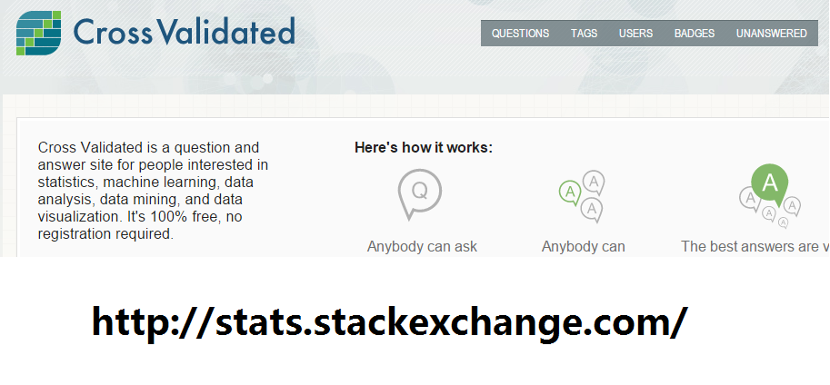
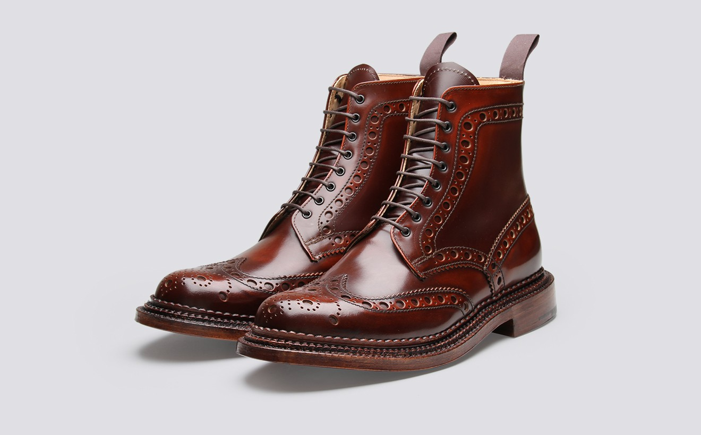

```{r echo=F}
# Load the Data
wine <- read.csv("wineQualityReds.csv")
# The variable X is just the row number, so I removed it
wine$X <- NULL
library(ggplot2)
library(ggthemes)
library(gridExtra)
theme_set(theme_minimal(11))
```

## What's Covered Last Time
- Best Subset Method
    + Consider all possible models
    + $2^p$
    + Impossible to do when $p$ is large
    + $2^{40} =10^{11}$
- Stepwise Method
    + Reduce the searching space for models
    + $p$ for first round, $p-1$ for second round, etc,
    + $0.5p^2$
    + $0.5\times 40^2 = 800$

## What's Covered Last Time
- Model Selection Criteria
    + For interpretation purpose: 
        * test results, t, F, etc.
    + In sample error(How well model fit the data we have)
        * $R^2$, Standard Error of Estimate, etc.
    + Out of sample error(How well model will like to perform on unseen data) 
        * Adjust in sample error estimates: $adj.R^2, C_p, AIC, BIC$ etc.
        * Directly estimate: Validation
- Machine Learning folks always do validation or...

## What's Covered Last Time
- Ridge and Lasso Regression
    + $\min_{\beta} (\Sigma(Y-\hat{Y})^2 + \lambda \Sigma{\beta}^2)$
    + $\min_{\beta} (\Sigma(Y-\hat{Y})^2 + \lambda \Sigma|{\beta}|)$
- Regression with Regularizers/ Regularization Term
- Shrinkage Methods
- Can perform feature/model selection for you
- How to choose $\lambda$... 
    + Of course validation would work
- $\lambda$ is a `Hyper Parameter`, meaning:
    + it is not a parameter in your model
    + it controls the complexity of your model

## Example Data Set for Today
+ The red wine dataset
+ P. Cortez, A. Cerdeira, F. Almeida, T. Matos and J. Reis. Modeling wine preferences by data mining from physicochemical properties. In Decision Support Systems, Elsevier, 47(4):547-553. ISSN: 0167-9236.    
+ We are interested in predicting wine quality  
+ It is a classification problem today

## Example Data Set for Today
+ Variables in the dataset  
```{r}
str(wine)
```

## Example Data Set for Today
```{r}
qplot(wine$quality, geom = "bar", binwidth = 1) +
    xlab("Wine Quality") + 
    ggtitle("Barplot of Wine Quality")
```

## Example Data Set for Today
+ For simplicity we only do binary classification as a starting point
+ Classify wines into $\leq 5$ or $\geq 6$ 
```{r}
wine$leqFive <- wine$quality <= 5
wine$quality <- NULL
table(wine$leqFive)
```

## Can We Just Use Linear Regression?
+ Dependent variable only take value 0 or 1  
```{r, cache = T}
p1 <- qplot(x = wine$leqFive , y = wine$alcohol, geom = "boxplot")
p2 <- qplot(x = wine$leqFive , y = wine$sulphates, geom = "boxplot")
p3 <- qplot(x = wine$leqFive , y = wine$citric.acid, geom = "boxplot")
p4 <- qplot(x = wine$leqFive , y = wine$volatile.acidity, geom = "boxplot")
grid.arrange(p1,p2,p3,p4, ncol = 2)
```

## Can We Just Use Linear Regression?  
+ What if we use a 0.5 as threshold to turn the linear regression model predictions into 0 and 1?
+ For example: if predicted value is $> 0.5$ we say it is high quality  
```{r}
model0 <- lm(leqFive~., wine)
pred0 <- predict(model0, wine)
pred0[1:20]
summary(pred0)
table(pred0 > 0.5)
```

## How Accurate is This Approach In Sample?
+ Not bad!
+ This approach has a name LDA
    - Linear Discriminant Analysis
+ It can do classification, but no interpretation at all.
+ We often want a probability interpretation in addition to the class labels  
```{r}
table(pred0 > 0.5, wine$leqFive)
accFromTable <- function(table) return(sum(diag(table))/sum(table)*100)
accFromTable(table(pred0 > 0.5, wine$leqFive))
```

## Logistic Regression Formula
+ Recall the definiation of Odds Ratio in elementary stats...
$$\frac{Pr(Y=1|X)}{1-Pr(Y=1|X)}$$ 
+ We take the natural logarithm of the Odds Ratio
$$log(\frac{Pr(Y=1|X)}{1-Pr(Y=1|X)})$$
+ What we get is called log odds or logit  
+ Instead of regress to the dependent variable, we regress to this logit 
$$log(\frac{Pr(Y=1|X)}{1-Pr(Y=1|X)}) = \beta^TX$$

## Logistic Regression Formula
$$log(\frac{Pr(Y=1|X)}{1-Pr(Y=1|X)}) = \beta^TX$$
+ If we solve for ${Pr(Y=1|X)}$, we can get:
$$Pr(Y=1|X) = \frac{e^{\beta^TX}}{1+e^{\beta^TX}}$$  
```{r}
linspace = seq(-10,10,0.1)
qplot(x = linspace, y = exp(linspace)/(1+exp(linspace)), geom = "line")
```

## Logistic Regression in R
+ Much better interpretability   
```{r}
model1 <- glm(leqFive~., data = wine, family = binomial)
pred1 <- predict(model1, wine,type = "response")
pred1[1:20]
summary(pred1)
accFromTable(table(pred1 > 0.5, wine$leqFive))
``` 

## Model Selection for Logistic Regression
+ Now... we are facing the same problem as with linear regression
+ How many and what variables should we use in the logistic regression model?
+ There is no adjusted estimatation for out of sample now
    - No $RSS$($SSE$) and $\sigma^2$ for classification  
    - So, No $adj.R^2$ for logistic regression..
    - Only have contengency table  
```{r}
table(pred1 > 0.5, wine$leqFive)
```
+ One thing we can get from the table is accuracy  
+ Will talk about other information we get from that table next time

## Which Model Rank Supreme?
```{r,echo=F}
formulas <- list()
variables <- c("alcohol",
               "volatile.acidity",
               "total.sulfur.dioxide",
               "sulphates",
               "free.sulfur.dioxide",
               "chlorides",
               "pH",
               "citric.acid",
               "fixed.acidity",
               "residual.sugar",
               "density")
formulas[[1]] <- "leqFive~alcohol"
for (i in 2:11){
    formulas[[i]] <- paste(formulas[[i-1]],"+",variables[i],sep="")
}
```

```{r}
for (i in 1:11)    print(formulas[[i]])
```


## Select Logitstic Regression Model
+ As you may guessed, we will do validation to select logistic regression models
+ We need to split the data into two parts: Training Set and Validation Set
+ Validation Set can be viewed as a random sample from our data, and so is the Training Set
+ And the data we have is in nature a sample of the population 
+ Take sample from a sample is called resample   
```{r}
set.seed(0363); n = nrow(wine)
split = sample(1:n, size = round(0.3*n), replace = F)
ValidationSet = wine[split, ]; TrainingSet = wine[-split,]
```

## Naive Resampling May Produce Bias
```{r}
hqRatio <- function(v) return(round(table(v)[2]/sum(table(v)),3))
c(hqRatio(wine$leqFive),
  hqRatio(ValidationSet$leqFive),
  hqRatio(TrainingSet$leqFive))
```

## Sampling Reserve the Ratio
```{r}
library(caTools); set.seed(1026)
split = sample.split(wine$leqFive,SplitRatio = 0.3)
ValidationSet = wine[split, ]; TrainingSet = wine[!split,]
c(hqRatio(wine$leqFive),
  hqRatio(ValidationSet$leqFive),
  hqRatio(TrainingSet$leqFive))
```

## Select Logistic Regression Model Using Validation
```{r}
val.acc <- vector()
for (i in 1:11){
    model <- glm(formulas[[i]], data = wine, family = binomial)
    pred <- predict(model,ValidationSet,type = "response")>0.5    
    acc <- accFromTable(table(pred, ValidationSet$leqFive))
    val.acc <- c(val.acc, acc)}
qplot(x = 1:11, y = val.acc, geom = "line")
```

## Is this 6 Variables Model Better?  
```{r}
formulas[[6]]
validatedModel <- glm(formulas[[6]], data = wine, family = binomial)
accFromTable(table(predict(validatedModel,wine, type = "response")>0.5,
                             wine$leqFive))
accFromTable(table(predict(model1,wine,type = "response")>0.5,
                             wine$leqFive))
```
+ Slightly better when tested in sample
+ More importantly, we are somewhat more confident that it may perform better on out of sample data than the full model as well. 
+ Because it is validated!   

## Cross Validation  
  
[link to cross validated](http://stats.stackexchange.com/questions/tagged/cross-validation)      

+ Sometime you ask question, sometime you answer question     
+ Sometime this part of data used for training, sometime this part of data used for validtion   

## Why Resampling?
+ Extract additional information about the model
+ Be it prediction accuracy, the variance or bias
+ We use resampling to get out of sample estimates of these things
+ A single Validation set approach is already useful, cross validation further reduces possible bias in estimation 
+ The ability to generalize to future unseen cases is the main concern for all machine learning practitioner

## Creating folds
+ We will do a 5-fold cross-validation here   
```{r, messaage = F, warning = F}
library(caret); set.seed(1126)
folds <- createFolds(wine$leqFive, k = 5)
folds[[1]][1:20]
folds[[2]][1:20]
```

## Cross Validation On Logistic Regression Model
```{r}
cv.Acc <- vector()
for (i in 1:11){
    Acc <- vector()
    for (k in 1:5){
        train <- wine[folds[[k]],]; val <- wine[-folds[[k]],]
        model <- glm(formulas[[i]], data = train, family = binomial)
        pred <- predict(model, val,type = "response") > 0.5
        Acc <- c(Acc, accFromTable(table(pred, val$leqFive)))
    }
    cv.Acc <- c(cv.Acc, mean(Acc))
}
```

## Cross Validation On Logistic Regression Model
```{r}
qplot(x = 1:11, y = cv.Acc, geom = "line")
```


## Is this 8 Variables Model Better?  
```{r}
formulas[[8]]
crossValidatedModel <- glm(formulas[[8]], data = wine, family = binomial)
accFromTable(table(predict(crossValidatedModel,wine,type = "response")>0.5,
                             wine$leqFive))
accFromTable(table(predict(model1,wine,type = "response")>0.5,
                             wine$leqFive))
```
+ Same in sample accuracy, 3 variables less than model1(the full model)
+ And, we have much more confident it may perform better on out of sample data than the full model...
+ Because it is Cross-validated!

## Doing Cross-Validation Using Packages
```{r, message = F, warning = F, cache = T}
library(boot); cv.delta <- vector(); set.seed(1126)
for (i in 1:11){
    fit <- glm(formulas[[i]], data = wine, family = binomial)
    cv.delta <- c(cv.delta, cv.glm(wine,fit, K = 10)$delta[2])}
qplot(x = 1:11, y = cv.delta, geom = "line")
```

## Lasso Regression Revisited
+ Selecting $\lambda$ using cross-validation   
```{r, message = F, warning = F, cache = T}
library(glmnet); library(ISLR); Hitters=na.omit(Hitters);
y=Hitters$Salary; X=model.matrix(Salary~.-1,data=Hitters) 
cv.lasso=cv.glmnet(X,y)
plot(cv.lasso)
```

## Using Lasso as LDA to Select Features for Wine Classification?
+ Six features chosen  
```{r,echo=2:4, cache = T}
library(glmnet)
y=wine$leqFive; X=model.matrix(leqFive~.-1,wine)
cv.lasso=cv.glmnet(X,y)
coef(cv.lasso)
```

## Bootstrap  
+ What is a Bootstrap ?


## Bootstrap
+ A resampling method that can be used to quantify the uncertainty associated with a given estimator
+ What is the mean, se with crtric.acid ?
+ We can't resample from the population, if we can, we can get the real sampling distribution    
+ We can however resample from the sample
```{r}
qplot(wine$citric.acid, binwidth =0.1)
```

## Bootstrap
+ Use bootstrap to estimate population mean and standard error   
```{r, cache = T}
boot.mean <- vector()
set.seed(123)
for (i in 1:99999){
    bootstrapSample <- sample(wine$citric.acid, nrow(wine), replace = T)
    boot.mean <- c(boot.mean, mean(bootstrapSample))}
mean(boot.mean) - mean(wine$citric.acid)
sd(boot.mean)
sd(wine$citric.acid)/sqrt(nrow(wine))
```

## Bootstrap
+ Use bootstrap to estimate mean and se of regression coefficients   
```{r, cache = T}
boot.slope <- vector()
set.seed(123)
for (i in 1:999){
    bootstrapSample <- sample(1:nrow(wine), nrow(wine), replace = T)
    model <- glm(leqFive~., data = wine[bootstrapSample,], family = binomial)
    boot.slope <- c(boot.slope, model$coefficients['fixed.acidity'])
}
```

## Bootstrap
```{r}
c(mean(boot.slope),sd(boot.slope))
summary(model1)$coefficients['fixed.acidity',]
```
+ Didn't seem to be perticular useful? 

## Bootstrap
+ Let's create a confidence interval of $adj.R^2$
```{r, cache = T}
boot.adj.r.square <- vector()
set.seed(123)
for (i in 1:999){
    bootstrapSample <- sample(1:nrow(Hitters), nrow(Hitters), replace = T)
    model <- lm(Salary~., data = Hitters[bootstrapSample,])
    boot.adj.r.square <- c(boot.adj.r.square, summary(model)$adj.r.square)
}
mean(boot.adj.r.square) + 1.96 * sd(boot.adj.r.square) * c(-1,1)
```

## Some Plots to Look At
+ We will go on talking about classification methods next week
+ Here are a few plots to look and think about before next week
```{r, echo = F, message = F, warning= F, cache = T}
p1 <- ggplot(wine, aes(x = fixed.acidity, y = alcohol)) + 
         geom_point(aes(color = leqFive), size = 4, alpha = 0.5) +
         scale_color_brewer(palette = "Set1") +
         xlab("fixed.acidity (g / dm^3)")+
         ylab("alcohol (% by volume)")+
         xlim(c(5, 14)) +
         ggtitle(paste("fixed.acidity against alcohol colored by leqFive")) + 
         labs(color = "quality <= 5") 

p2 <- ggplot(wine, aes(x = volatile.acidity, y = sulphates)) + 
         geom_point(aes(color = leqFive), size = 4, alpha = 0.5) +
         scale_color_brewer(palette = "Set1") +
         xlab("volatile.acidity (g / dm^3)")+
         ylab("sulphates (g / dm3)")+
         xlim(c(0.1, 1.1)) + 
         ylim(c(0.3, 1.4)) +
         ggtitle(paste("volatile.acidity against sulphates colored by leqFive")) +
         labs(color = "quality <= 5")

p3 <- ggplot(wine, aes(x = volatile.acidity, y = alcohol)) + 
         geom_point(aes(color = leqFive), size = 4, alpha = 0.5) +
         scale_color_brewer(palette = "Set1") +
         xlab("volatile.acidity (g / dm^3)")+
         ylab("alcohol (% by volume)")+
         xlim(c(0.1,1.2)) + 
         ggtitle(paste("volatile.acidity against alcohol colored by leqFive")) +
         labs(color = "quality <= 5")

p4 <- ggplot(wine, aes(x = chlorides, y = alcohol)) + 
         geom_point(aes(color = leqFive), size = 4, alpha = 0.5) +
         scale_color_brewer(palette = "Set1") +
         xlab("chlorides (g / dm^3)")+
         ylab("alcohol (% by volume)")+
         xlim(c(0.02,0.15)) + 
         ylim(c(8,14)) +
         ggtitle(paste("chlorides against alcohol colored by leqFive")) + 
         labs(color = "quality <= 5")

grid.arrange(p1,p2,p3,p4, ncol = 2)
```