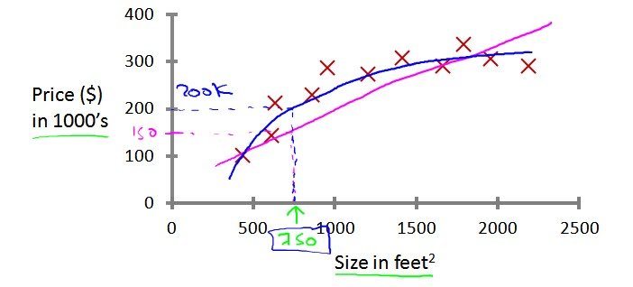
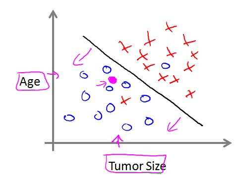
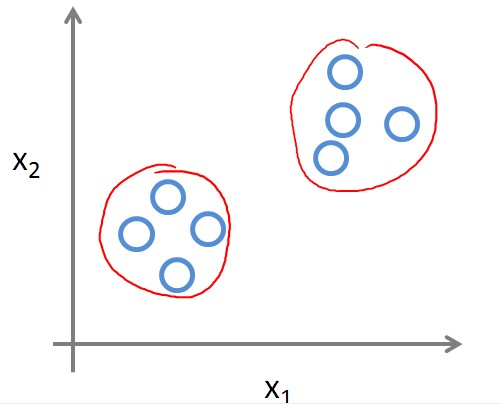
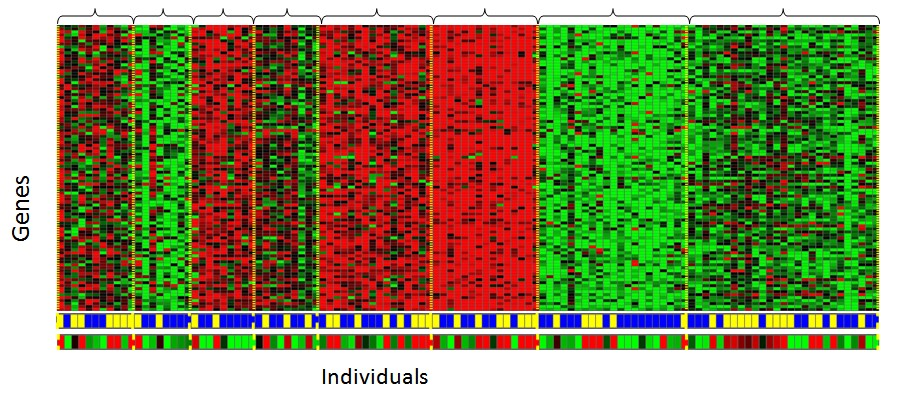

## What is Machine Learning
+ "Field of study that gives computers the ability to learn without being explicitly programmed." -- Arthur Samuel (1959)

+ "computer program is said to learn from experience E with respect to some task T and some performance measure P, if its performance on T, as measured by P, improves with experience E." -- Tom Mitchell (1998)

+ "... just another name for computational statistics." -- Stats Profs.

+ "... just an application of  optimization techniques." -- OR/Math Profs.

+ "... just some algorithms we use in data mining. " -- Data Mining Guru.

## So What is Machine Learning, Really?
+ It is just a black box.   
+ Input -> Black Box -> Output   
+ So what's in the box?
+ What ever makes the output useful.

## Types of learning problems
1. Supervised Learning  
    with training labels given  
    want to predict unlabeled data
2. Unsupervised Learning  
    no training lables given  
    want to generate labels for training data
3. Other more complicated   
    Reinforcement Learning  
    Transfer Learning  
    Semi~something learning 
    etc.
    
## Basic types of supervised learning
1. Regression  
    output is real value
2. Classification  
    output is a category

## Regression

## Classification

## Clustering 

## PCA 

## Basic ML Procedure

## Let's do a linear regression in R

