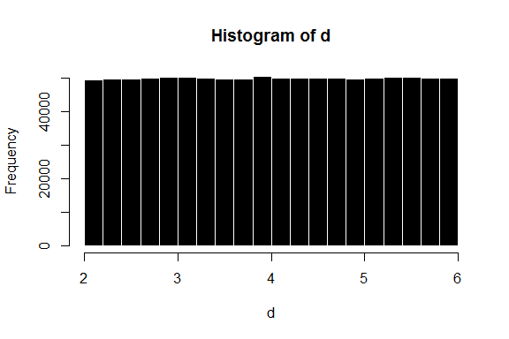
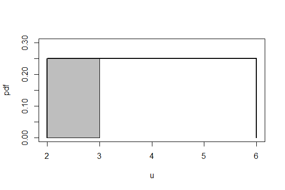
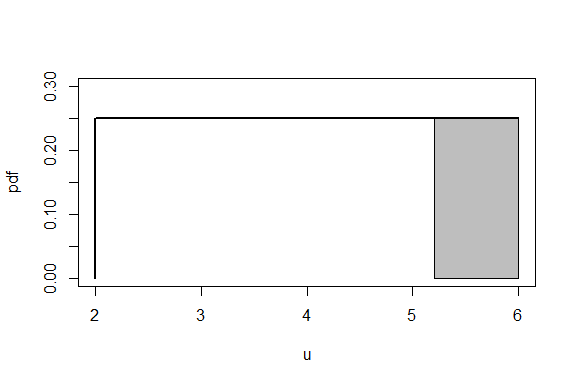
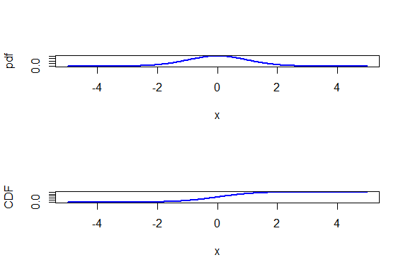
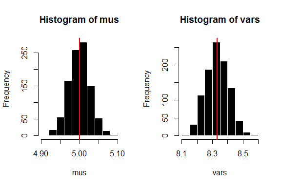

# 连续概率
Ryan Zhang  

## 连续随机变量
+ 概率密度函数(Probability Density Function, PDF)
    - 一个连续随机变量的概率密度函数用于描述变量取值在一定区间内时的概率
    $$Pr(a\leq X \leq b)=\int_{a}^bf_X(x)dx$$
+ 累积分布函数(CDF)
    $$F_X(x)=Pr(X\leq x)$$

## 期望,期望法则和方差
+ 期望：
    $$\mathbb{E}[X]=\int_{-\infty}^{\infty}xf_X(x)dx$$
+ 期望法则：
    $$\mathbb{E}[g(X)]=\int_{-\infty}^{\infty}g(x)f_X(x)dx$$
+ 方差:
    $$var(X)=\mathbb{E}[(X-\mathbb{E}[X])^2]\\
    =\int_{-\infty}^{\infty}(x-\mathbb{E}[X])^2f_X(x)dx\\
    =\mathbb{E}[X^2]-(\mathbb{E}[X])^2$$
    
## 均匀分布
+ 均匀分布(Uniform Distribution)
    $$f_X(x)=\begin{cases}\frac{1}{b-a},\qquad \text{for }a\leq x \leq b\\
    0, \qquad \qquad \text{otherwise}\end{cases}$$
    $$\mathbb{E}[X]=\mu_X=\frac{a+b}{2}$$
    $$var(X)=\sigma_X=\frac{(b-a)^2}{12}$$

## 均匀分布

```r
xvals = seq(2,6,length=100)
plot(xvals, dunif(xvals,2,6), type="l", 
     xlab="u", ylab="pdf", lwd=2, ylim=c(0,0.3))
segments(x0=2,y0=0,x1=2,y1=1/4, lwd=2)
segments(x0=6,y0=0,x1=6,y1=1/4, lwd=2)
```

 

## 均匀分布

```r
set.seed(100)
d <- runif(999999, 2, 6)
hist(d, border = 0, col = "black")
```

 

## 均匀分布

```r
punif(3,2,6)
```

```
## [1] 0.25
```

```r
xvals = seq(2,6,length=100)
plot(xvals, dunif(xvals,2,6), type="l", 
     xlab="u", ylab="pdf", lwd=2, ylim=c(0,0.3))
segments(x0=2,y0=0,x1=2,y1=1/4, lwd=2)
segments(x0=6,y0=0,x1=6,y1=1/4, lwd=2)
polygon(x = c(2,2,3,3),
        y = c(0,.25,.25,0),
        col="grey")
```

 

## 均匀分布

```r
qunif(0.8,2,6)
```

```
## [1] 5.2
```

```r
xvals = seq(2,6,length=100)
plot(xvals, dunif(xvals,2,6), type="l", 
     xlab="u", ylab="pdf", lwd=2, ylim=c(0,0.3))
segments(x0=2,y0=0,x1=2,y1=1/4, lwd=2)
segments(x0=6,y0=0,x1=6,y1=1/4, lwd=2)
polygon(x = c(5.2,5.2,6,6),
        y = c(0,.25,.25,0),
        col="grey")
```

 

## 正态分布
+ 正态分布(Normal Distribution)/高斯分布(Gaussian Distribution)
    - 对称
    - 两个参数
    - 两端的尾部渐近(asymptotic)与横坐标
    $$f_X(x)=\frac{1}{\sigma\sqrt{2\pi}}exp(-\frac{(x-\mu)^2}{2\sigma^2})$$
    $$X\sim N(\mu,\sigma^2)$$
    $$\mathbb{E}[X]=\mu$$
    $$var(X)=\sigma^2$$
    
## 正态分布

```r
xvals = seq(-5, 5, length=300)
par(mfrow=c(2,1))
plot(xvals, dnorm(xvals), type="l", lwd=2, col="blue", xlab="x", ylab="pdf")
plot(xvals, pnorm(xvals), type="l", lwd=2, col="blue", xlab="x", ylab="CDF")
```

 

## 标准正态分布
+ 标准正太分布(Standard Normal Distribution)
    $$X\sim N(0,1^2)$$
+ 标准尺度(Z score)
    $$Z = \frac{X-\mu_X}{\sigma_X}$$

## 正态分布

```r
pnorm(1.645, 0, 1)
```

```
## [1] 0.9500151
```

```r
pnorm(-1.96, 0, 1)
```

```
## [1] 0.0249979
```

```r
qnorm(0.025,0,1)
```

```
## [1] -1.959964
```

## 蒙特卡洛模拟

```r
set.seed(123)
mus <- vector() -> vars
for (i in 1:999){
    d <- runif(9999,0,10)
    mus <- c(mus,mean(d))
    vars <- c(vars,var(d))
}
par(mfrow=c(1,2))
hist(mus, border = 0, col = "black")
abline(v = 5, lwd = 2, col = "red")
hist(vars, border = 0, col = "black")
abline(v = 25/3, lwd = 2, col = "red")
```

 

## 蒙特卡洛模拟
$Pr($数据(统计量)$|$模型(参数)$)$

```r
quantile(mus,0.01,type =6)
```

```
##       1% 
## 4.932483
```

```r
quantile(mus,0.05,type =6)
```

```
##       5% 
## 4.953059
```

```r
quantile(mus,0.1,type =6)
```

```
##      10% 
## 4.964107
```

```r
quantile(mus,0.5,type =6)
```

```
##      50% 
## 5.000066
```

