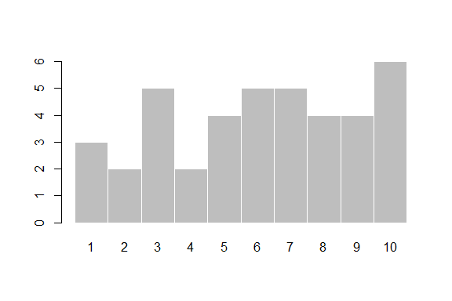
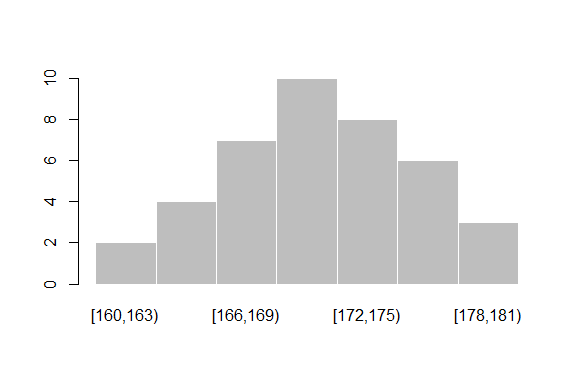
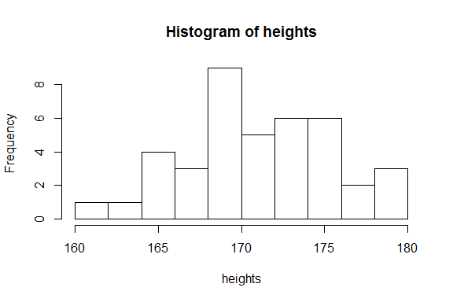
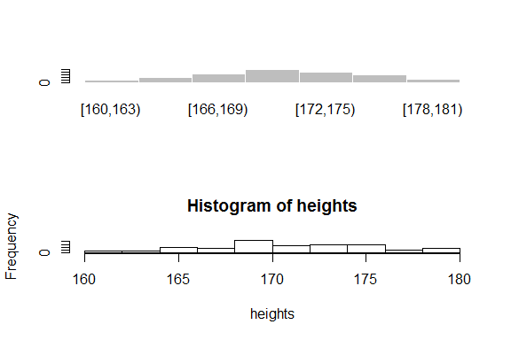
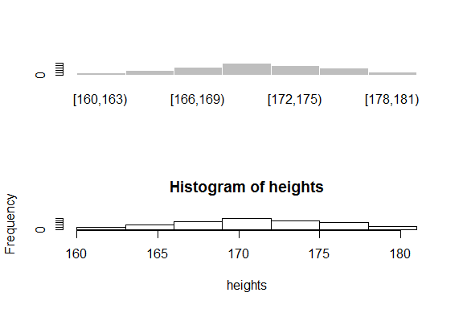
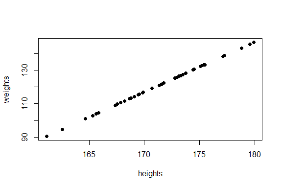

# 图表方法
Ryan Zhang  

## 定性数据的总结
+ 对一部电影的40个评分

```r
set.seed(123)
ranks <- as.factor(sample(10,40,replace = T ))
ranks
```

```
##  [1] 3  8  5  9  10 1  6  9  6  5  10 5  7  6  2  9  3  1  4  10 9  7  7 
## [24] 10 7  8  6  6  3  2  10 10 7  8  1  5  8  3  4  3 
## Levels: 1 2 3 4 5 6 7 8 9 10
```

## 定性数据的总结
+ 频率分布(Frequency Distribution):  
    - 将定性数据归类，计算每个类有多少个数据点

```r
table(ranks)
```

```
## ranks
##  1  2  3  4  5  6  7  8  9 10 
##  3  2  5  2  4  5  5  4  4  6
```

## 定性数据的总结
+ 柱状图(Bar Chart)

```r
barplot(table(ranks), space = 0, border = 0)
```

 

## 定性数据的总结
+ 相对频率分布(Relative Frequency Distribution):  
    - 频率分布除以样本量

```r
table(ranks)/length(ranks)
```

```
## ranks
##     1     2     3     4     5     6     7     8     9    10 
## 0.075 0.050 0.125 0.050 0.100 0.125 0.125 0.100 0.100 0.150
```

## 定性数据的总结
+ 百分比相对频率分布(Percent Relative Frequency Distribution):
    - 相对频率分布*100%

```r
table(ranks)/length(ranks)*100
```

```
## ranks
##    1    2    3    4    5    6    7    8    9   10 
##  7.5  5.0 12.5  5.0 10.0 12.5 12.5 10.0 10.0 15.0
```

## 定性数据的总结
+ 饼图(Pie Chart)

```r
pie(table(ranks), border = 0)
```

 

## 定量数据的总结
+ 40个人的身高

```r
set.seed(123)
heights <- rnorm(40, 171, 5)
heights
```

```
##  [1] 168.1976 169.8491 178.7935 171.3525 171.6464 179.5753 173.3046
##  [8] 164.6747 167.5657 168.7717 177.1204 172.7991 173.0039 171.5534
## [15] 168.2208 179.9346 173.4893 161.1669 174.5068 168.6360 165.6609
## [22] 169.9101 165.8700 167.3555 167.8748 162.5665 175.1889 171.7669
## [29] 165.3093 177.2691 173.1323 169.5246 175.4756 175.3907 175.1079
## [36] 174.4432 173.7696 170.6904 169.4702 169.0976
```

## 定量数据的总结
+ 频率分布：
    - 将数据归入设定好的若干区间中

```r
b <- seq(160, 181, 3)
heights.cut <- cut(heights, breaks = b, right = F)
table(heights.cut)
```

```
## heights.cut
## [160,163) [163,166) [166,169) [169,172) [172,175) [175,178) [178,181) 
##         2         4         7        10         8         6         3
```

## 定量数据的总结
+ 相对频率分布(Relative Frequency Distribution):
    - 频率分布除以样本大小

```r
table(heights.cut)/length(heights.cut)
```

```
## heights.cut
## [160,163) [163,166) [166,169) [169,172) [172,175) [175,178) [178,181) 
##     0.050     0.100     0.175     0.250     0.200     0.150     0.075
```

## 定量数据的总结
+ 直方图(Histogram):
    - 对定量数据计算频率分布，然后将频率分布以柱状图形式表示出来

```r
barplot(table(heights.cut), border = 0, space = 0)
```

 

## 定量数据的总结

```r
hist(heights)
```

 

## 定量数据的总结

```r
par(mfrow=c(2,1)) 
barplot(table(heights.cut), border = 0, space = 0)
hist(heights)
```

 

## 定量数据的总结

```r
par(mfrow=c(2,1)) 
barplot(table(heights.cut), border = 0, space = 0)
hist(heights, breaks = b, right = F)
```

 

## 定量数据的总结
+ 茎叶图(Stem and Leaf Diagram): 
    - 将值分为两部分

```r
stem(heights,scale =2)
```

```
## 
##   The decimal point is at the |
## 
##   161 | 2
##   162 | 6
##   163 | 
##   164 | 7
##   165 | 379
##   166 | 
##   167 | 469
##   168 | 2268
##   169 | 15589
##   170 | 7
##   171 | 4668
##   172 | 8
##   173 | 01358
##   174 | 45
##   175 | 1245
##   176 | 
##   177 | 13
##   178 | 8
##   179 | 69
```

## 定量数据的总结

```r
h <- hist(heights, plot = F, breaks = b, right = F)
h$mids
```

```
## [1] 161.5 164.5 167.5 170.5 173.5 176.5 179.5
```

```r
h$counts
```

```
## [1]  2  4  7 10  8  6  3
```

## 定量数据的总结
+ 多边形(Polygon): 
    - 将直方图各个方块的上方中点连接起来

```r
plot(h$mids, h$counts, type="l")
points(h$mids, h$counts, pch = 19)
```

 

## 定量数据的总结
+ 累积频率分布(Cumulative Frequency Distribution):
    - 值小于各个区间的上限的数据点数量

```r
cumsum(table(heights.cut))
```

```
## [160,163) [163,166) [166,169) [169,172) [172,175) [175,178) [178,181) 
##         2         6        13        23        31        37        40
```

## 定量数据的总结
+ 累积相对频率分布(Cumulative Relative eFrequency Distribution):
    - 值小于各个区间的上限的数据点数量与样本大小的比值

```r
cumsum(table(heights.cut)/length(heights))
```

```
## [160,163) [163,166) [166,169) [169,172) [172,175) [175,178) [178,181) 
##     0.050     0.150     0.325     0.575     0.775     0.925     1.000
```

## 定量数据的总结
+ 累积曲线(Ogive): 
    - 用曲线表示累积频率分布

```r
plot(cumsum(table(heights.cut)), pch = 19, xaxt = "n")
axis(1,at = 1:(length(b)-1) ,labels = b[2:length(b)])
lines(cumsum(table(heights.cut)))
```

 

## 定量数据的总结
+ 散点图(Scatter Plot):
    - 用于揭示两个变量之间的关系

```r
set.seed(123)
weights <- rnorm(40, 120, 15)
plot(heights, weights, pch = 19)
```

 

