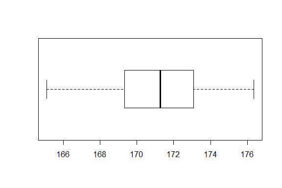
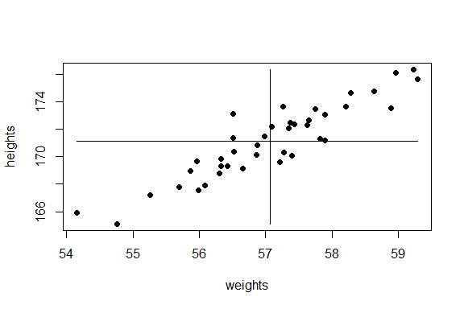

# 描述性的数值度量
Ryan Zhang  

## 中央位置的度量
+ 算术平均(Arithmetic Mean):
    - 样本算术平均:
    $$\bar{X} = \frac{\Sigma x_i}{n}$$
    - 总体算术平均：
    $$\mu = \frac{\Sigma x_i}{N}$$

## 中央位置的度量

```r
set.seed(123)
heights <- rnorm(40, 171, 3)
sum(heights)/length(heights)
```

```
## [1] 171.1355
```

```r
mean(heights)
```

```
## [1] 171.1355
```

## 中央位置的度量
+ 中位数(Median):
    - 50%的数据小于该值
    - 1 将数据从小到大排列
    - 2a 若样本量为基数：中位数为中间一个
    - 2b 若样本量为偶数：中位数为中间两个数的算术平均
    
## 中央位置的度量

```r
heights <- sort(heights)
heights
```

```
##  [1] 165.1001 165.9399 167.2048 167.5856 167.7965 167.9220 168.8133
##  [8] 168.9394 169.1249 169.3186 169.3325 169.5816 169.6630 169.8586
## [15] 170.0821 170.1148 170.3095 170.3461 170.8143 171.2115 171.3320
## [22] 171.3879 171.4601 172.0794 172.2023 172.2794 172.3827 172.4936
## [29] 172.6618 173.0659 173.1041 173.4647 173.5134 173.6344 173.6854
## [36] 174.6722 174.7614 175.6761 176.1452 176.3607
```

```r
(heights[20]+heights[21])/2
```

```
## [1] 171.2718
```

```r
median(heights)
```

```
## [1] 171.2718
```

## 中央位置的度量
+ 众数(Mode)：
    - 出现次数最多的数
    - 定性数据唯一有意义的中央位置度量
    
## 中央位置的度量

```r
set.seed(123)
ranks <- as.factor(sample(10,99,replace = T ))
ranks
```

```
##  [1] 3  8  5  9  10 1  6  9  6  5  10 5  7  6  2  9  3  1  4  10 9  7  7 
## [24] 10 7  8  6  6  3  2  10 10 7  8  1  5  8  3  4  3  2  5  5  4  2  2 
## [47] 3  5  3  9  1  5  8  2  6  3  2  8  9  4  7  1  4  3  9  5  9  9  8 
## [70] 5  8  7  8  1  5  3  4  7  4  2  3  7  5  8  2  5  10 9  9  2  2  7 
## [93] 4  7  4  2  8  1  5 
## Levels: 1 2 3 4 5 6 7 8 9 10
```

```r
tfRanks <- sort(table(ranks))
tfRanks[tfRanks == max(tfRanks)]
```

```
##  5 
## 14
```

## 中央位置的度量

```r
myMode <- function(data){
    sdata <- sort(table(data))
    sdata[sdata == max(sdata)]
}
myMode(ranks)
```

```
##  5 
## 14
```

## 中央位置的的测量
+ 算术平均易受到异常值的影响:

```r
mean(heights)
```

```
## [1] 171.1355
```

```r
mean(c(heights, 272))
```

```
## [1] 173.5957
```

```r
median(c(heights, 272))
```

```
## [1] 171.332
```

## 百分位数和盒子图
+ 百分位数(Percentile)
    - p百分位数将数据分为两个部分，其中大约有百分之p的观测值小于其，剩余的则大于该数。
+ 中位数是50百分位数

## 百分位数和盒子图
+ 计算方法：
    1. 将数据从小到大排序
    2. 计算相对位置：
    $$L_p=(n+1)\frac{p}{100}$$
    3. 如果$L_p$是整数，则该位置的数即为所要的百分位数
    4. 否则要使用与$L_p$最近的两个整数进行一个综合
例如：$L_p=2.25$, 使用如此的近似$q_{p/100}=x_2+(x_3-x_2)\times 0.25$

## 百分位数和盒子图

```r
myPercentile <- function(data,p){
    data <- sort(data)
    Lp <- (length(data)+1)*p/100
    if (is.integer(Lp)){data[Lp]}
    else {data[floor(Lp)]+(data[ceiling(Lp)]-data[floor(Lp)])*(Lp-floor(Lp))}
    }
myPercentile(heights, 15)
```

```
## [1] 168.0557
```

```r
quantile(heights, probs = 0.15, type = 6)
```

```
##      15% 
## 168.0557
```

## 百分位数和盒子图
+ 五数总结(Five Number Summary)：
    - 用五个数字总结一个定量变量
    1. 最小值
    2. 25百分位数 Q1 $q_{.25}$
    3. 中位数
    4. 75百分位数 Q3 $q_{.75}$
    5. 最大值
+ 范围(Range)： 最大-最小 $q_{.75}-q_{.25}$
+ 四分位数(IQR,Inter-Quartile Range)

## 百分位数和盒子图

```r
quantile(heights, c(0,.25,.50,.75,1), type = 6)
```

```
##       0%      25%      50%      75%     100% 
## 165.1001 169.3220 171.2718 173.0945 176.3607
```

```r
summary(heights)
```

```
##    Min. 1st Qu.  Median    Mean 3rd Qu.    Max. 
##   165.1   169.3   171.3   171.1   173.1   176.4
```

```r
max(heights)-min(heights)
```

```
## [1] 11.26059
```

```r
IQR(heights)
```

```
## [1] 3.746457
```

## 百分位数和盒子图
+ 异常值检测：
    $$> Q3+1.5\times IQR$$
    $$< Q1-1.5\times IQR$$

## 百分位数和盒子图
+ 盒子图(Boxplot):

```r
summary(heights)
```

```
##    Min. 1st Qu.  Median    Mean 3rd Qu.    Max. 
##   165.1   169.3   171.3   171.1   173.1   176.4
```

```r
boxplot(heights, horizontal = T, pch = 8)
```

 

## 百分位数和盒子图

```r
summary(heights)
```

```
##    Min. 1st Qu.  Median    Mean 3rd Qu.    Max. 
##   165.1   169.3   171.3   171.1   173.1   176.4
```

```r
boxplot(c(heights,226), horizontal = T, pch = 8)
```

 

```r
1.5*IQR(heights)+quantile(heights,.75,type=6)
```

```
##      75% 
## 178.7142
```

## 离散度(Dispersion)的度量
+ 平均绝对偏差(Mean Absolute Deviation, MAD):
    - 观测量和平均值之间差的绝对值之和
    - 样本MAD：
    $$\frac{\Sigma|x_i-\bar{X}|}{n}$$
    - 总体MAD：
    $$\frac{\Sigma|x_i-\mu|}{N}$$
    
## 离散度(Dispersion)的度量

```r
myMad <- function(data) sum(abs(data-mean(data)))/length(data)
myMad(heights)
```

```
## [1] 2.186391
```

## 离散度(Dispersion)的度量
+ 方差(Standard Deviation):
    - 观测量和平均值之间差的平方之和
    - 样本方差：
    $$s^2 = \frac{\Sigma(x_i-\bar{X})^2}{n-1}$$
    - 总体方差：
    $${\sigma}^2=\frac{\Sigma(x_i-\mu)^2}{N}$$

## 离散度(Dispersion)的度量

```r
mySampleVariance <- function(data) sum((data-mean(data))^2/(length(data)-1))
mySampleVariance(heights)
```

```
## [1] 7.254156
```

```r
var(heights)
```

```
## [1] 7.254156
```

## 离散度(Dispersion)的度量
+ 标准差(Standard Deviation):
    - 方差开根号
    - 样本标准差：
    $$s = \sqrt{s^2}$$
    - 总体标准差：
    $$\sigma = \sqrt{{\sigma}^2}$$

```r
mySampleSD <- function(data) sqrt(mySampleVariance(data))
mySampleSD(heights)
```

```
## [1] 2.693354
```

```r
sd(heights)
```

```
## [1] 2.693354
```

## 离散度(Dispersion)的度量
+ 变异系数(coefficient of Variation, CV)
    - 标准差除以均值


## 协方差和相关系数
+ 协方差(covariance):
    - 两个变量之间线性关系的方向性度量
    - 样本协方差
    $$s_{xy}=\frac{\Sigma(x_i-\bar{X})(y_i-\bar{Y})}{n-1}$$
    - 总体协方差
    $$\sigma_{xy}=\frac{\Sigma(x_i-\mu_{X})(y_i-\mu_{Y})}{N}$$

## 协方差和相关系数

```r
set.seed(231)
weights <- heights/3+rnorm(40,0,0.5)
plot(weights, heights, pch = 19)
lines(x = rep(mean(weights),2), y = c(min(heights),max(heights)))
lines(y = rep(mean(heights),2), x = c(min(weights),max(weights)))
```

 

## 协方差和相关系数

```r
cov(heights, weights)
```

```
## [1] 2.857333
```

## 协方差和相关系数
+ 相关系数(Correlation Coefficient):
    - 两个变量之间线性关系的方向性以及强度
    - 样本协方差
    $$r_{xy}=\frac{s_{xy}}{s_X s_Y}$$
    - 总体协方差
    $$\rho_{xy}=\frac{\sigma_{xy}}{\sigma_X \sigma_Y}$$

```r
cor(heights, weights)
```

```
## [1] 0.9151442
```

