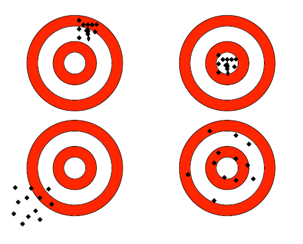
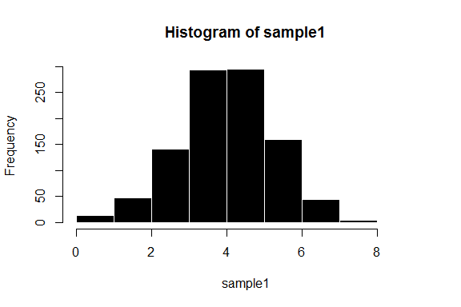
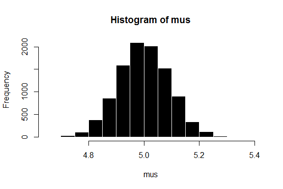

# 抽样分布
Ryan Zhang  

## 抽样方法
+ 简单随机抽样(Simple Random Sampling)
+ 分组抽样(Cluster Sampling)
+ 分层随机抽样(Stratified Random Sampling)
+ 见[Wikipedia article](https://en.wikipedia.org/wiki/Sampling_(statistics)#Simple_random_sampling)

## 抽样偏差
+ 抽样偏差(Samping Bias):
    - 偏差
    $$\mathbb{E}[\hat{\theta}-\theta]=\mathbb{E}[\hat{\theta}]-\theta$$

    - 选择偏差(Selection Bias)
    - 不响应偏差(Nonresponse Bias)

## 抽样

```r
normaldata <- rnorm(999999, mean = 4, sd = 1.2)
sample1 <- sample(normaldata, size = 1000, replace = F)
hist(sample1, border = 0, col = "black")
```

 

## 估计量与估计值
+ 估计量(Estimator)：
    - 因样本而变的随机变量
    - 估计值的计算方法
+ 估计值(Estimation)：
    - 针对手头样本，按照估计量描述的方法计算出的具体值
+ 均方差(Mean Squared Error):
    $$\mathbb{E}[(\bar{X}-\mu)^2]$$

## 样本期望的抽样分布
+ 用样本期望($\bar{X}$)作为总体期望$\mu$的估计量
    - 基于概率论的分析方法
    $$\mathbb{E}[\bar{X}]=\mu$$
    $$var(\bar{X})=\frac{\sigma^2}{n}$$
    - 基于蒙特卡洛模拟

## 莫特卡罗模拟的抽样分布

```r
set.seed(123)
mus <- vector() 
for (i in 1:9999){
    d <- runif(999,0,10)
    mus <- c(mus,mean(d))
}
```

## 莫特卡罗模拟的抽样分布

```r
(0+10)/2
```

```
## [1] 5
```

```r
mean(mus)
```

```
## [1] 4.999537
```

```r
10^2/12
```

```
## [1] 8.333333
```

```r
var(mus)*999
```

```
## [1] 8.404051
```

## 中央极限定理
+ 中央极限定理(Central Limit Theorem):
    - 对于任意总体$X$(总体期望$\mu$,方差$\sigma$),当样本量足够大($n\geq  30$)时$\bar{X}$的抽样分布近似满足正态分布

```r
hist(mus, border = 0, col = "black")
```

 

## 偏差和方差分解
+ 均方差的偏差和方差分解
$$MSE(\hat{\theta},\theta)=\mathbb{E}[(\hat{\theta}-\theta)^2]$$
$$=\mathbb{E}[(\mathbb{E}[\hat{\theta}-\theta])^2]+\mathbb{E}[(\hat{\theta}-\mathbb{E}[\hat{\theta})]]^2$$
$$=var(\hat{\theta})+bias(\hat{\theta},\theta)^2$$
    - 当bias = 0 时
$$SE(\hat{\theta})=\sqrt{var(\hat{\theta})} = \sqrt{MSE}$$


